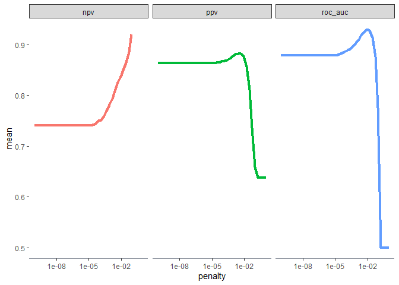
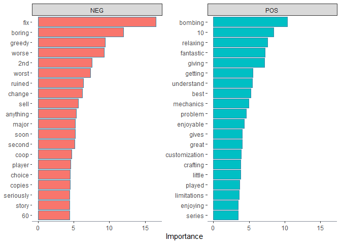

Sentiment analysis for Animal Crossing user reviews
================

> This report is written based on [Julia Silge’s
> blog](https://juliasilge.com/blog/animal-crossing/). However, I also
> attempt to incorporate my own thoughts and learnings.
> 
> \~ humble beginner

## About

This report will look to provide insights using data exploration and
machine learning on [tidytuesday’s Animal Crossing - New
Horizons](https://github.com/rfordatascience/tidytuesday/tree/master/data/2020/2020-05-05)
data set.

It’s worth mentioning that I have never heard of Animal Crossing and I
apologize if I sound ignorant. However, good news, after upon competion
of this report, I would have up knowledge about this.

In my own understanding, Animal Crossing is game where it gives users
the ability to participate in a life like simulation. You are given
tools and enviroments for you to freely explore, comparable to likes of
Minecraft and SIMS.

Hence, like every product created for human consumption, this games
allows for users to rate their experience. The title probably gave it
away but you guessed it\! We are going to look into the those user
reviews and perform a **sentiment analysis**.

## Data

We are going to use the `skimr` package to look at a comprehensive
summary of the data

``` r
user_reviews <- 
  readr::read_tsv("https://raw.githubusercontent.com/rfordatascience/tidytuesday/master/data/2020/2020-05-05/user_reviews.tsv")

skimr::skim_tee(user_reviews, skim_fun = skim_without_charts)
```

    ## -- Data Summary ------------------------
    ##                            Values
    ## Name                       data  
    ## Number of rows             2999  
    ## Number of columns          4     
    ## _______________________          
    ## Column type frequency:           
    ##   character                2     
    ##   Date                     1     
    ##   numeric                  1     
    ## ________________________         
    ## Group variables            None  
    ## 
    ## -- Variable type: character ------------------------------------------------------------------------
    ## # A tibble: 2 x 8
    ##   skim_variable n_missing complete_rate   min   max empty n_unique whitespace
    ## * <chr>             <int>         <dbl> <int> <int> <int>    <int>      <int>
    ## 1 user_name             0             1     3    15     0     2999          0
    ## 2 text                  0             1    18  5358     0     2996          0
    ## 
    ## -- Variable type: Date -----------------------------------------------------------------------------
    ## # A tibble: 1 x 7
    ##   skim_variable n_missing complete_rate min        max        median     n_unique
    ## * <chr>             <int>         <dbl> <date>     <date>     <date>        <int>
    ## 1 date                  0             1 2020-03-20 2020-05-03 2020-03-27       45
    ## 
    ## -- Variable type: numeric --------------------------------------------------------------------------
    ## # A tibble: 1 x 10
    ##   skim_variable n_missing complete_rate  mean    sd    p0   p25   p50   p75  p100
    ## * <chr>             <int>         <dbl> <dbl> <dbl> <dbl> <dbl> <dbl> <dbl> <dbl>
    ## 1 grade                 0             1  4.22  4.35     0     0     2    10    10

This data set is pretty straightforward. We see that each observation
(or row) represent a review made by a user. In total we have 2999 review
where each observation gives information about the

  - **user\_name**: reviewer’s username
  - **text**: the review’s commentary
  - **date**: date of which the review was posted, looks like there’s 2
    months worth of reviews
  - **grade**: numeric rating given by the user with a range from 0 to
    10

## Exploratory

Lets look at the distriubtion of the outcome variable, **grade**:

``` r
user_reviews %>% 
  count(grade) %>% 
  ggplot(aes(x = grade, y = n)) +
  geom_col()
```


Off the bat, the distribution looks peculiar. Both tails are quite
heavy.

However, lets give this some thought. These are review grades, hence ask
yourself how often do you leave a review and when you do, why did you do
it?

Most answers would be they rarely leave grades and when they do its
because of extreme events such as complains or over the top
satisfaction. Applying this logic, it make sense to see high density on
either side of grade scale (i.e people often only rate 0 or 10. Looking
at the distribution, it wont be wise to model the grades directly,
especially that this is my first time. Rather it would be better if we
can turn this into a classification problem where we split the grades
into bad or good rating. Let’s say that a rating below 7 is bad.

``` r
reviews_parsed <- user_reviews %>%
  mutate(text = str_remove(text, "Expand$")) %>%
  mutate(rating = case_when(
    grade > 7 ~ "good",
    TRUE ~ "bad"
  ))
```

We could do a lot more on explatory analysis, but my skills are still at
its infancy (especially text mining). Hence, I think we have just enough
to move on to modeling.

## Modeling

First, we will set a seed for reproducibilty.

Then we will split the reviews into a train set and test set using
stratified sampling. We use stratified sampling so that we have a
balanced proportion of good and bad ratings in both data sets.

``` r
set.seed(123)
review_split <- initial_split(reviews_parsed, strata = rating)
review_train <- training(review_split)
review_test <- testing(review_split)
```

Now that we have our train set and test set, lets look at their
proportions of rating:

``` r
review_train %>% 
  count(rating) %>% 
  mutate(prop = n / sum(n), split = "train") %>% 
  bind_rows(
    review_test %>% 
      count(rating) %>% 
      mutate(prop = n / sum(n), split = "test")
  ) %>% 
  select(split, rating, n, prop) %>% 
  ggplot(aes(x = rating, y = prop)) +
  geom_col() +
  facet_wrap(split~.)
```


Great, there’s a good balance of ratings in both data sets.

Next is data preprocessing. We will use `recipes` package for this,
however since this project deal with text variables, we will also use
`textrecipes` package.

### Data Preprocessing

From what I read, I understand in this step is where data mining,
feature engineering and imputation happens. Essentially, we are trying
to make existing predictors better and relevant while also adding new
variables that could add value.

``` r
review_rec <- 
  recipe(rating ~ text, data = review_train) %>%
  step_tokenize(text) %>%
  step_stopwords(text) %>%
  step_tokenfilter(text, max_tokens = 500) %>%
  step_tfidf(text) %>%
  step_normalize(all_predictors())

review_prep <- prep(review_rec)

review_prep
```

    ## Data Recipe
    ## 
    ## Inputs:
    ## 
    ##       role #variables
    ##    outcome          1
    ##  predictor          1
    ## 
    ## Training data contained 2250 data points and no missing data.
    ## 
    ## Operations:
    ## 
    ## Tokenization for text [trained]
    ## Stop word removal for text [trained]
    ## Text filtering for text [trained]
    ## Term frequency-inverse document frequency with text [trained]
    ## Centering and scaling for tfidf_text_0, tfidf_text_1, tfidf_text_10, ... [trained]

We have a column called `text` in our data set. This column holds the
review comments of the user. As its own, this column means almost
nothing to a predictive model. The character strings that it holds are
too long and unqiue and if we atttempt to use the column as it is, our
models will most definitely turn out bad or even fail.

This is where data preprocessing comes in. Let’s try to bring out
valueable column/predictors from the `text` column

Lets go through what we did above one by one - step\_tokenize: The
character string in our column `text` can be very long and most probably
unique. It would make more sense to cut up the string into smaller
strings and then identify numerically if it exists in an observation.
Here we cut up the string into words. In other words, one token = one
word.

  - step\_stopwords: We use this to remove any tokens that are stop
    words which give no or very low predicting power such as “is, it,
    there”.

  - step\_tokenfilter: If the string is very long, it is likely that too
    many token will be created. The greater the number of tokens, the
    greater number of predictors. Unless you have loads of RAM to spare,
    it wont be a good idea to include too many predictors. Hence, in
    here we limit the number of tokens (or in this case predictors) to
    500.

  - step\_tf: tf stands for term frequency (counts). This measures how
    many times each token appears in the `text` column. For instance.
    when our weight\_scheme is set to “binary”, if the token “amazing”
    appears once, then it returns a 1. If it appears twice, then it
    returns a 2. If there isn’t any matching ones, then it returns a 0.
    Pretty neat I must say. But we can take this up a notch.

  - step\_tfidf: tfidf stands for “term frequency, inverse document
    frequency”. It holds the same principle as above but it incorporates
    how common or rare the token is among all the observation in the
    returned values.

  - step\_normalize: This is also known as centering your data. What
    this does it takes the average of all the values and subtracts it
    from the data.

Now we have our data read for modeling

### Modeling

For our model, we are going to use a lasso regression from the `glmnet`
package. I am quite sure there are other models we can use, however
since this was suggested, I am going for this one.

``` r
lasso_spec <- 
  logistic_reg(penalty = tune(), mixture = 1) %>%
  set_engine("glmnet")

lasso_wf <- workflow() %>%
  add_recipe(review_rec) %>%
  add_model(lasso_spec)

lasso_wf
```

    ## == Workflow ===============================================================================================
    ## Preprocessor: Recipe
    ## Model: logistic_reg()
    ## 
    ## -- Preprocessor -------------------------------------------------------------------------------------------
    ## 5 Recipe Steps
    ## 
    ## * step_tokenize()
    ## * step_stopwords()
    ## * step_tokenfilter()
    ## * step_tfidf()
    ## * step_normalize()
    ## 
    ## -- Model --------------------------------------------------------------------------------------------------
    ## Logistic Regression Model Specification (classification)
    ## 
    ## Main Arguments:
    ##   penalty = tune()
    ##   mixture = 1
    ## 
    ## Computational engine: glmnet

You will notice that we have not set the penalty to value. Penalty is a
hyperparameter, which means it is a paramter that the model cannot learn
but itself and rather would rely on a hardcoded input.

Since guessing the value would be bad (especially that am a newbie), we
can iteratively try different penalties to see which one produces a
model with the best performance. This is called hyperparameter tuning.

### Hyperparameter tuning

Now, to find the best penalty value, we will do a grid search where we
first make a grid of all the penalty values that we want to check and
then produce a model with each of those penalties.

``` r
lambda_grid <- grid_regular(penalty(), levels = 40)

lambda_grid
```

    ## # A tibble: 40 x 1
    ##     penalty
    ##       <dbl>
    ##  1 1.00e-10
    ##  2 1.80e-10
    ##  3 3.26e-10
    ##  4 5.88e-10
    ##  5 1.06e- 9
    ##  6 1.91e- 9
    ##  7 3.46e- 9
    ##  8 6.24e- 9
    ##  9 1.13e- 8
    ## 10 2.03e- 8
    ## # ... with 30 more rows

With the above, we have our grid with all the penalty values. Before we
perform the tuning, we can perform resampling to get mutiple datasets.

Here we will use bootstrap resampling. This method creates a specified n
number of dataset with the same number of observation as the original
data set. Keep in mind this sampling is done while using replacement.

In plain words, when you are sampling to create a new dataset, before
you randomly choose pick the next observation, you must return the last
picked observation back where it will it possible to be repicked. Hence,
you may have duplicates in your resampled data.

``` r
set.seed(123)
review_folds <- bootstraps(review_train, strata = rating)
review_folds
```

    ## # Bootstrap sampling using stratification 
    ## # A tibble: 25 x 2
    ##    splits             id         
    ##    <named list>       <chr>      
    ##  1 <split [2.2K/812]> Bootstrap01
    ##  2 <split [2.2K/850]> Bootstrap02
    ##  3 <split [2.2K/814]> Bootstrap03
    ##  4 <split [2.2K/814]> Bootstrap04
    ##  5 <split [2.2K/853]> Bootstrap05
    ##  6 <split [2.2K/840]> Bootstrap06
    ##  7 <split [2.2K/816]> Bootstrap07
    ##  8 <split [2.2K/826]> Bootstrap08
    ##  9 <split [2.2K/804]> Bootstrap09
    ## 10 <split [2.2K/809]> Bootstrap10
    ## # ... with 15 more rows

We are now ready to tune the model with grid and resampled data.

Of course, to pick the best performing model, there must be some
quantifiable metric that could give some indication. In a classification
problem, the most common metric would be AUC aka area under the curve.
Hence, this will be our main metric that we will use to decide the most
suitable penalty value. Additionally, we will also look at postive
predicitive values (ppv) and negative positive values (npv). This gives
an independent indication of how well we predict postive values (grade =
good) and how well we predict negative predictive values (grade = bad).

This process may be time consuming, hence we can use parallel computing
to speed things up.

``` r
# doParallel::registerDoParallel()

set.seed(2020)

lasso_grid <- 
  tune_grid(
    lasso_wf,
    resamples = review_folds,
    grid = lambda_grid,
    metrics = metric_set(roc_auc, ppv, npv)
    )
```

Let’s have a look at what does that look like:

``` r
lasso_grid %>%
  collect_metrics()
```

    ## # A tibble: 120 x 6
    ##     penalty .metric .estimator  mean     n std_err
    ##       <dbl> <chr>   <chr>      <dbl> <int>   <dbl>
    ##  1 1.00e-10 npv     binary     0.740    25 0.00518
    ##  2 1.00e-10 ppv     binary     0.864    25 0.00302
    ##  3 1.00e-10 roc_auc binary     0.878    25 0.00276
    ##  4 1.80e-10 npv     binary     0.740    25 0.00518
    ##  5 1.80e-10 ppv     binary     0.864    25 0.00302
    ##  6 1.80e-10 roc_auc binary     0.878    25 0.00276
    ##  7 3.26e-10 npv     binary     0.740    25 0.00518
    ##  8 3.26e-10 ppv     binary     0.864    25 0.00302
    ##  9 3.26e-10 roc_auc binary     0.878    25 0.00276
    ## 10 5.88e-10 npv     binary     0.740    25 0.00518
    ## # ... with 110 more rows

Maybe, add some visualisation to help us see better.

``` r
lasso_grid %>%
  collect_metrics() %>%
  ggplot(aes(penalty, mean, color = .metric)) +
  geom_line(size = 1.5, show.legend = FALSE) +
  facet_wrap(~.metric) +
  scale_x_log10()
```

<!-- -->

Here, we can see that AUC and PPV peaks but NPV doesn’t. We could add
more features to try and peak out NPV but sometimes it is what it.

### Choose the best model

We will pick the best performing model based on AUC metric as our final
model and fit it.

``` r
best_auc <- 
  lasso_grid %>%
  select_best("roc_auc")

final_lasso <- 
  finalize_workflow(lasso_wf, best_auc) %>% 
  fit(review_train)

final_lasso
```

    ## == Workflow [trained] =====================================================================================
    ## Preprocessor: Recipe
    ## Model: logistic_reg()
    ## 
    ## -- Preprocessor -------------------------------------------------------------------------------------------
    ## 5 Recipe Steps
    ## 
    ## * step_tokenize()
    ## * step_stopwords()
    ## * step_tokenfilter()
    ## * step_tfidf()
    ## * step_normalize()
    ## 
    ## -- Model --------------------------------------------------------------------------------------------------
    ## 
    ## Call:  glmnet::glmnet(x = as.matrix(x), y = y, family = "binomial",      alpha = ~1) 
    ## 
    ##      Df    %Dev   Lambda
    ## 1     0 0.00000 0.137200
    ## 2     2 0.01443 0.125000
    ## 3     3 0.03349 0.113900
    ## 4     4 0.05169 0.103800
    ## 5     4 0.07042 0.094570
    ## 6     6 0.08920 0.086170
    ## 7     7 0.11050 0.078510
    ## 8    12 0.13310 0.071540
    ## 9    17 0.15940 0.065180
    ## 10   22 0.18690 0.059390
    ## 11   26 0.21480 0.054120
    ## 12   28 0.24160 0.049310
    ## 13   29 0.26610 0.044930
    ## 14   35 0.29000 0.040940
    ## 15   41 0.31400 0.037300
    ## 16   45 0.33670 0.033990
    ## 17   52 0.35830 0.030970
    ## 18   60 0.38010 0.028220
    ## 19   70 0.40160 0.025710
    ## 20   86 0.42350 0.023430
    ## 21   95 0.44550 0.021340
    ## 22  104 0.46620 0.019450
    ## 23  110 0.48570 0.017720
    ## 24  123 0.50420 0.016150
    ## 25  130 0.52220 0.014710
    ## 26  144 0.53920 0.013410
    ## 27  154 0.55580 0.012210
    ## 28  162 0.57150 0.011130
    ## 29  178 0.58630 0.010140
    ## 30  190 0.60060 0.009240
    ## 31  202 0.61440 0.008419
    ## 32  214 0.62770 0.007671
    ## 33  231 0.64060 0.006989
    ## 34  239 0.65300 0.006369
    ## 35  247 0.66460 0.005803
    ## 36  259 0.67560 0.005287
    ## 37  271 0.68630 0.004818
    ## 38  277 0.69650 0.004390
    ## 39  286 0.70630 0.004000
    ## 40  295 0.71550 0.003644
    ## 41  310 0.72440 0.003321
    ## 42  321 0.73290 0.003026
    ## 43  338 0.74120 0.002757
    ## 44  345 0.74930 0.002512
    ## 45  354 0.75730 0.002289
    ## 46  363 0.76490 0.002085
    ## 
    ## ...
    ## and 54 more lines.

Here’s our final model\!

One of important insight that a model can provide is variable
importance. Lets look the top 20 most important predictor (word) that
helps predict if it has positive or negative rating.

``` r
final_lasso %>%
  pull_workflow_fit() %>%
  vi(lambda = best_auc$penalty) %>%
  group_by(Sign) %>%
  top_n(20, wt = abs(Importance)) %>%
  ungroup() %>%
  mutate(
    Importance = abs(Importance),
    Variable = str_remove(Variable, "tfidf_text_"),
    Variable = fct_reorder(Variable, Importance)
  ) %>%
  ggplot(aes(x = Importance, y = Variable, fill = Sign)) +
  geom_col(show.legend = FALSE) +
  facet_wrap(~Sign, scales = "free_y") +
  labs(y = NULL)
```

<!-- -->

From here you can see what words contributed to a positive and negative
rating.

For the bad grades, we see word like “greedy” and “sell” that could
indicate that users are not to happy around the economizing of the game.

FOr the good grades, we see word like “relaxing”, “fantastic” and
“enjoyable” which are clear signs of satisfaction. However, the word
“bombing” maybe of concern and worth a look back the data to find out
what this is.
