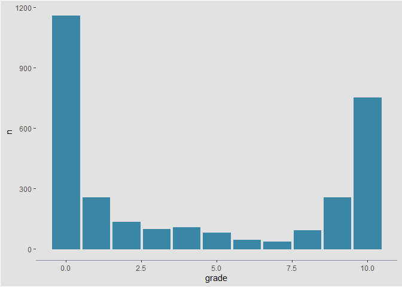
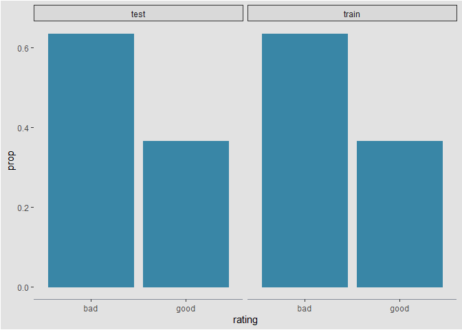

Sentiment analysis for Animal Crossing user reviews
================

> “Disclaimer: This report was written more of a practice for me than
> giving actual analytic insights”
> 
> — humble beginner

## About

This report will look to provide insights using data exploration and
machine learning models on a [tidytuesday’s **Animal Crossing - New
Horizons**](https://github.com/rfordatascience/tidytuesday/tree/master/data/2020/2020-05-05)
data set.

Its worth mentioning that I have never heard of Animal Crossing and I
apologize if I had been ignoring. However, good news, after I am done
with report, I would have topped up my knowledge about this.

In my own understanding Animal Crossing is game where it gives users the
ability to participate in a life like simulation. Like comparable games
like Minecraft, you are given tools and enviroments for you to freely
explore.

Hence, like every product created for human consumption, this games
allows for users to rate their experience. The title probably already
spoiled it but you guessed it\! We are going to look into the those user
reviews and perform a sentiment analysis.

## Data

We are going to use the `skimr` package to look at a comprehensive
summary of the data

``` r
user_reviews <- 
  readr::read_tsv("https://raw.githubusercontent.com/rfordatascience/tidytuesday/master/data/2020/2020-05-05/user_reviews.tsv")

skimr::skim_tee(user_reviews, skim_fun = skim_without_charts)
```

    ## -- Data Summary ------------------------
    ##                            Values
    ## Name                       data  
    ## Number of rows             2999  
    ## Number of columns          4     
    ## _______________________          
    ## Column type frequency:           
    ##   character                2     
    ##   Date                     1     
    ##   numeric                  1     
    ## ________________________         
    ## Group variables            None  
    ## 
    ## -- Variable type: character ------------------------------------------------------------------------
    ## # A tibble: 2 x 8
    ##   skim_variable n_missing complete_rate   min   max empty n_unique whitespace
    ## * <chr>             <int>         <dbl> <int> <int> <int>    <int>      <int>
    ## 1 user_name             0             1     3    15     0     2999          0
    ## 2 text                  0             1    18  5358     0     2996          0
    ## 
    ## -- Variable type: Date -----------------------------------------------------------------------------
    ## # A tibble: 1 x 7
    ##   skim_variable n_missing complete_rate min        max        median     n_unique
    ## * <chr>             <int>         <dbl> <date>     <date>     <date>        <int>
    ## 1 date                  0             1 2020-03-20 2020-05-03 2020-03-27       45
    ## 
    ## -- Variable type: numeric --------------------------------------------------------------------------
    ## # A tibble: 1 x 10
    ##   skim_variable n_missing complete_rate  mean    sd    p0   p25   p50   p75  p100
    ## * <chr>             <int>         <dbl> <dbl> <dbl> <dbl> <dbl> <dbl> <dbl> <dbl>
    ## 1 grade                 0             1  4.22  4.35     0     0     2    10    10

This data set is pretty straightforward. We see that each observation
(or row) represent a review made by a user. In total we have 2999 review
with ach observation giving information about the

  - user\_name: reviewer’s username
  - text: the review’s commentary
  - date: date of which the review was posted, looks like there’s 2
    months worth of reviews
  - grade: numeric rating given by the user with a range from 0 to 10

## Exploratory

Lets look at the outcome’s variable distribution:

``` r
user_reviews %>% 
  count(grade) %>% 
  ggplot(aes(x = grade, y = n)) +
  geom_col()
```



Off the bat, the distribution of looks weird. Both tails are quite
heavy.

However, lets give this some thought. These are review grades, hence ask
yourself how often do you leave a review and when you do, why did you do
it?

Most answers would be they rarely leave grades and when they do its
because of extreme events such as complains or over the top experience.
Applying this logic, it make sense to see high density on either side of
grade scale.

Looking at the distribution, it wont be wise to try a model grades
directly, especially that this is my first time. Rather, if we can turn
this into a classification problem where we split the grades in to bad
or good rating. Let’s say that a rating below 7 is bad.

``` r
reviews_parsed <-
  user_reviews %>% 
  mutate(
    rating = case_when(
      grade > 7 ~ "good",
      TRUE ~ "bad"
    )
    )
```

We could do a lot more on explatory analysis, but my skills are still at
its infancy (especially text mining). Hence, I think we have enough to
move on to modeling.

## Modeling

First, we will set a seed for reproducibilty.

Then we will split the reviews into a train set and test set using
stratified sampling. We use stratified sampling so that we have balanced
proportion of good and bad ratings in both data sets.

``` r
# set the seed for reproducibilty
set.seed(123)

# stratified sampling so that we have balanced proportion of good and bad ratings in both data sets
review_split <- initial_split(reviews_parsed, strata = rating) 

# extract training data
review_train <- training(review_split)
review_test <- testing(review_split)
```

Now that we have our train set and test set, let look at their
proportions of ratings

``` r
# check the rating count in train and test set
review_train %>% 
  count(rating) %>% 
  mutate(prop = n / sum(n), split = "train") %>% 
  bind_rows(
    review_test %>% 
      count(rating) %>% 
      mutate(prop = n / sum(n), split = "test")
  ) %>% 
  select(split, rating, n, prop) %>% 
  ggplot(aes(x = rating, y = prop)) +
  geom_col() +
  facet_wrap(split~.)
```



Great, there’s a good balance of ratings in both data sets.
